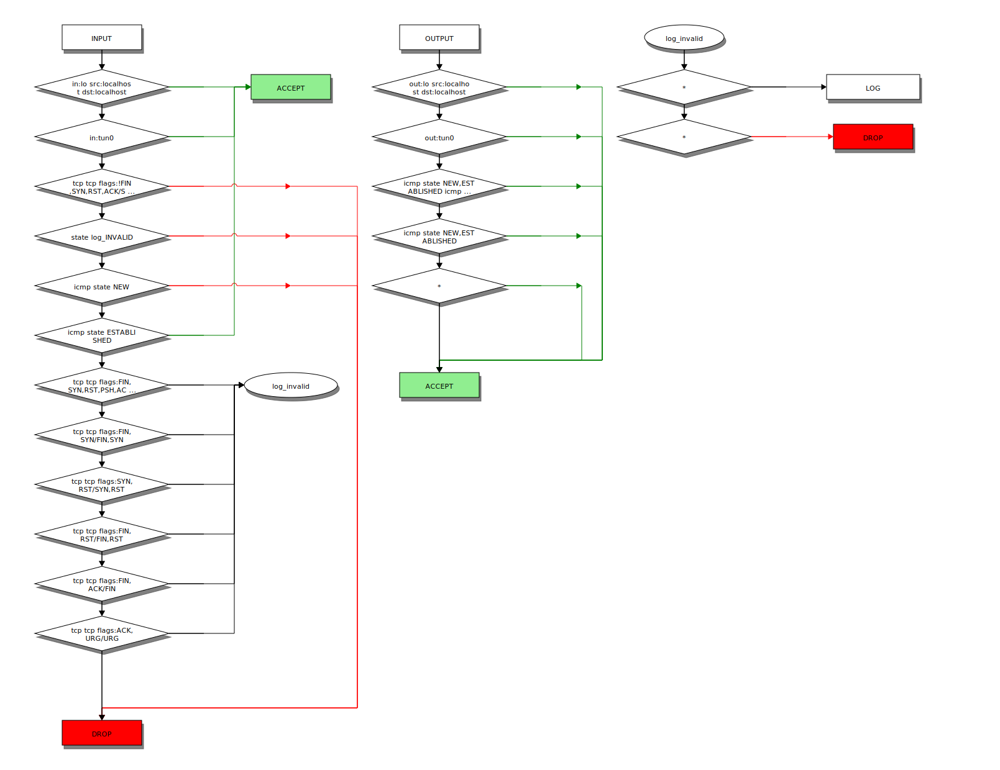
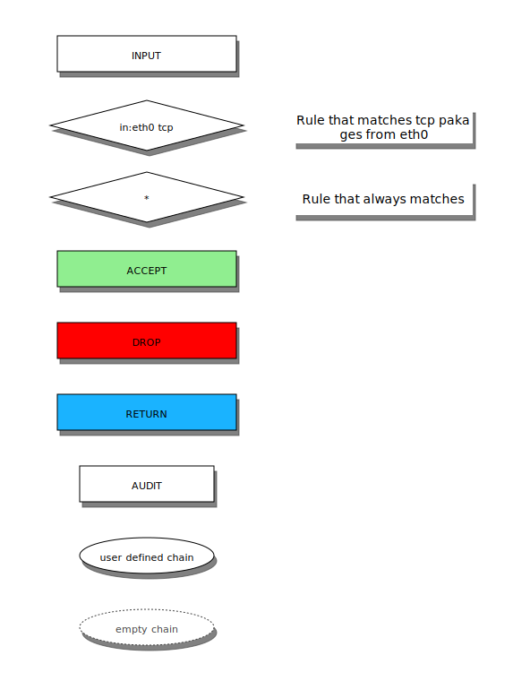

iptables-vis – visualise iptables chains
========================================

This script reads iptables output and generates a nice flow chart. Works with all tables and chains.

Usage
=====
- Clone repo, make sure awk is installed, install [blockdiag](http://blockdiag.com)
- `iptables -v -L > iptables.txt`
- `awk -f iptables-vis.awk < iptables.txt > iptables.dia`
- `blockdiag iptables.dia -T svg -o iptables.svg`

To display only selected chains (supports regexp):

`awk -f iptables-vis.awk -v 'chain_selector=INPUT|OUTPUT|mychain' < iptables.txt > iptables.dia`

To also render empty chains:

`awk -f iptables-vis.awk -v 'include_empty_chains=1 < iptables.txt > iptables.dia'`

Legend
======

